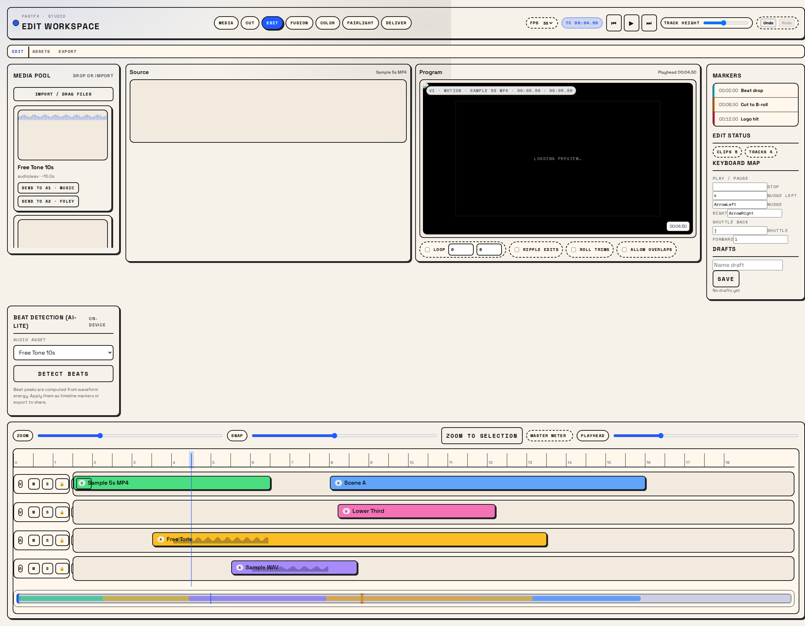
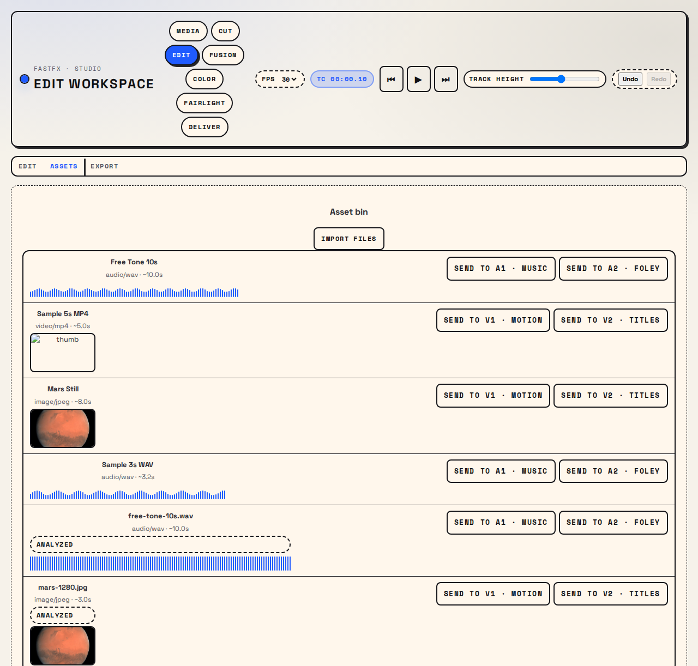
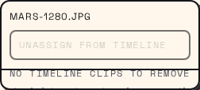
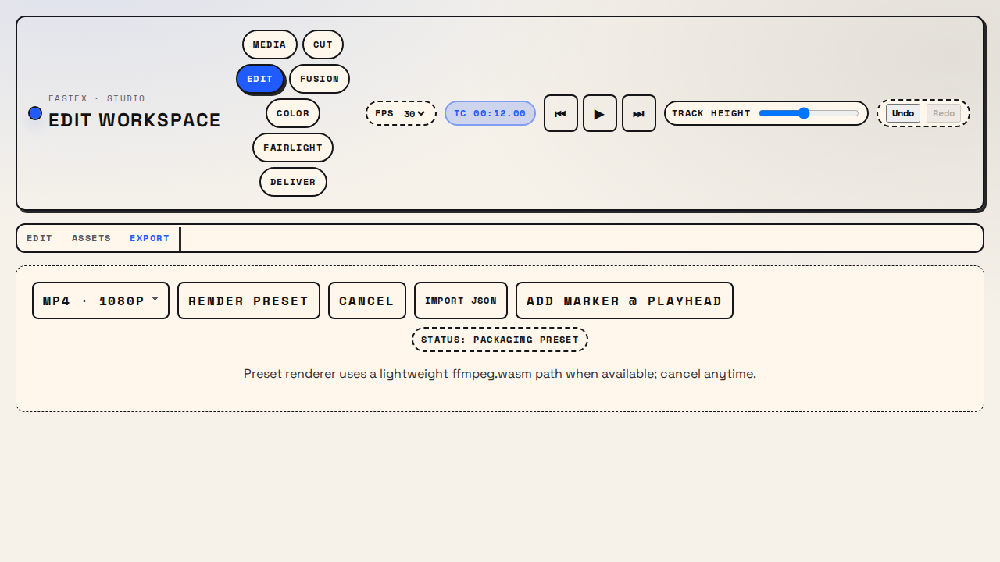

# Beat Picture Editing App (Timeline Builder)

This repo ships a desktop-style timeline builder (PySide6) plus a React + Vite prototype. Features include snapping (markers/edges/gaps), ripple moves/trims, loop ranges, asset ingest with waveforms/thumbs, zoom/pan controls, beat detection, text-on-beat overlays, and export presets. Playwright smoke tests ship with recorded video/screenshot outputs.

Desktop app (Python)
- `bash run_timeline.sh`
  - Creates `.venv` + installs `requirements.txt`
  - Launches the timeline builder UI

Web quick start
- `cd web`
- `npm install`
- `npm run dev -- --host --port 4178` then open http://localhost:4178

Captures (see `web/screenshots/`)
- Edit overview: `web/screenshots/edit-overview.png`
- Assets tab (with free sample image + tone): `web/screenshots/assets.png`
- Asset context menu: `web/screenshots/asset-context.png`
- Export tab: `web/screenshots/export.png`
- Run video: `web/screenshots/timeline-run.webm`

Tests & build (from `web/`)
- Smoke test + recording: `npm run test:e2e`
- Production build: `npm run build`
- Playwright browsers live in your Linux home cache (`~/.cache/ms-playwright`); if running from NTFS, set `PLAYWRIGHT_BROWSERS_PATH=~/.cache/ms-playwright` to avoid chmod issues.

Sample media
Bundled free assets live in `web/public/samples/`. New truly-free examples:
- `free-tone-10s.wav` – 10s sine tone generated in-house (public domain)
- `mars-1280.jpg` – NASA/ESA Mars true-color image (public domain)
Legacy samples from Samplelib (mp4 / short wav / photo) remain for convenience. Use the Assets tab file picker or drag directly onto tracks.

Current feature set
- Audio + video playback synced to playhead; track-aware mute/solo/lock; loop ranges.
- Timeline trims: ripple, roll, slip, slide (alt+trim handles); snapping to markers/edges.
- Clip visuals: audio waveforms on clips; video thumbnails captured on import.
- **New: Individual Track Resizing**: Drag the bottom edge of any track header to resize it.
- **New: Media Bin List View**: Toggle between Grid and List views for better asset management.
- **Updated UI**: Lab notebook neo-brutalist styling (bold type + clean panels).

## Screenshots

| Edit overview | Assets tab | Asset context | Export tab |
| --- | --- | --- | --- |
|  |  |  |  |

More details
See `web/README.md` for feature notes, shortcuts, and file map.
